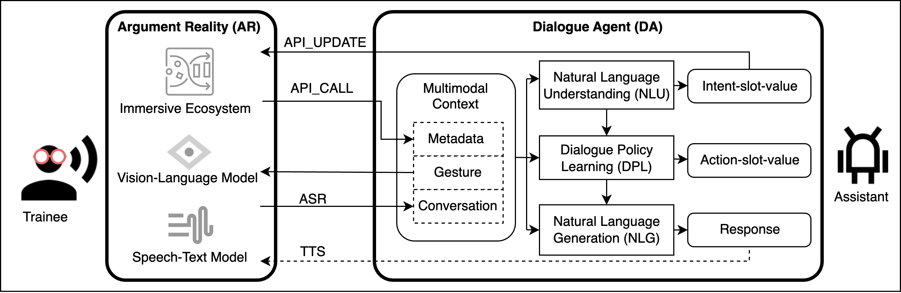

# 1. Introduction
Enlighten by the state-of-the-art [LLM Powered Autonomous Agents](https://lilianweng.github.io/posts/2023-06-23-agent/), we develop an Augmented Reality Training Assistant (ARTA) workflow based on [LangChain](https://github.com/langchain-ai/langchain) framework. 
In this work, we aim to introduce Large Language Models (LLMs) as human-like "brain" to augment Argument Reality (AR) system with artificial Intelligence; 
and vice versa, we enable Argument Reality (AR) system to provide services by external API tools to augment general LLMs specifically for the ARTA use case, so that AR system can better plan which tool to use and when to use based on fully understanding users' need.
Therefore, there are three key phrase as follows:
- Phase 1: Development of the workflow using general LLMs.
- Phase 2: Create ARTA dataset by asking trainees to play with assistant using the workflow.
- Phase 3: Finetune LLMs and replace it in the workflow.



[//]: # (## 2.1 LangChain&#40;[repo]&#40;https://github.com/langchain-ai/langchain&#41;, [doc]&#40;https://python.langchain.com/docs/get_started/introduction&#41;&#41;)

[//]: # (## 2.2 Llama-2 &#40;[repo]&#40;https://github.com/facebookresearch/llama&#41;, [doc]&#40;https://huggingface.co/docs/transformers/main/model_doc/llama2&#41;&#41; + **Toolformer** &#40;[repo]&#40;https://github.com/lucidrains/toolformer-pytorch&#41;&#41; )

[//]: # (In ToolFormer, you pre-train the LLM with examples, so it can, by itself, figure out what APIs are useful for what data. In other words, by teaching it to convert a statement like Two + Three = Five to Two + Three = Calculator&#40;2+3&#41;, you teach it to respond to Two + Three =  with Calculator&#40;2+3&#41;. And then we code up the Calculator API to get the answer, Five and the LLM continues from there [1]&#40;https://www.jezer0x.com/using-external-apis-to-augment-llms/&#41;.)


[//]: # (- [godel]&#40;https://github.com/microsoft/GODEL&#41;)

# 2. Setup
Create a virtual environment and install basic requirements.
```bash
conda create -n vox
source activate vox
pip install requirements.txt
```

## Lang Chain 
Install LangChain([repo](https://github.com/langchain-ai/langchain), [doc](https://python.langchain.com/docs/get_started/introduction)) and the required dependencies.
```bash
pip install langchain[all]
pip install openai
```
Set up the keys in a `.env` file in the root directory of the project. Inside the file, add environment variables such as your OpenAI API key ([apply](https://openai.com/blog/openai-api)):

```file
OPENAI_API_KEY="your_api_key_here"
```
Save the file and close it. In your Python script or Jupyter notebook, load the .env file using the following code:
```file
from dotenv import load_dotenv, find_dotenv
load_dotenv(find_dotenv())
```

## Lang Chain Server (Optional)
You only need this if you want to deploy DA on a local/cloud server. If you only want to play with interactive demo, you can skip this section.
```shell
# Theoretically, you can install it with the following one line, but it does not work for me (See https://github.com/jina-ai/langchain-serve/issues/143).
# pip install langchain-serve
git clone https://github.com/jina-ai/langchain-serve.git
cd langchain-serve
# change jina==3.20.2 in requirements.txt
pip install .
```

[//]: # (## 2.2 Llama-2 + toolformer)

[//]: # (Download and install llama2.)

[//]: # (```bash)

[//]: # (git clone https://github.com/facebookresearch/llama.git)

[//]: # (cd llama)

[//]: # (pip install -e .)

[//]: # (pip install toolformer-pytorch)

[//]: # (```)

[//]: # ()
[//]: # (Convert to the model at [Huggingface]&#40;https://huggingface.co/&#41;.)

[//]: # (```bash)

[//]: # (# $DATA_DIR='/media/PampusData/jpei')

[//]: # (# source )

[//]: # (python vox_llama2/convert_llama_weights_to_hf.py --input_dir $DATA_DIR/llama_data --model_size 7B --output_dir $DATA_DIR/transformer_data/llama-2-7b-chat)

[//]: # (```)

# 3. Qucik start by running an interactive demo
```shell
cd ./LEGO_dialogue_agent_openai
python agent_cli.py
```

# 4. Implementation details
We choose a toy LEGO AR system, namely [BlockDream](https://github.com/kukeya/2023-SWContest/tree/main) , as an example to show how this workflow functions for ARTA use case.
The AR system can be more complex and practical ones such as [HOLO](https://holo-light.com/) systems.

## 4.1 Equip DA with APIWrapper to call customized AR tools
We implement a toolkit (a set of APIs / interfaces) to call the services or functions (as in table) provided by the AR system for LLMs to plan which and when to use.
(See more implementation details at [lego_api_wrapper.py](LEGO_dialogue_agent_openai%2Ftools_wrappers%2Flego_api_wrapper.py))

| No | AR functions  | Description                                                                |
|----|---------------|----------------------------------------------------------------------------|
| 1  | StartAssemble | to initiate the assembly process.                                          |
| 2  | NextStep      | to move to the next assembly step.                                         |
| 3  | FrontStep     | to go back to the previous assembly step.                                  |
| 4  | Explode       | to trigger an explosion for detailed viewing.                              |
| 5  | Recover       | to restore the initial state of the VR objects after explosion.            |
| 6  | FinishedVideo | to end the assembly process and show a video of the assembled LEGO bricks. |
| 7  | ReShow        | to repeat the current assembly step.                                       |
| 8  | Enlarge       | to enlarge or zoom out the current object.                                 |
| 9  | Shrink        | to shrink or zoom in the current object.                                   |

## 4.2 Develop DA's API service
We develop an API service  ([agent_cli.py](LEGO_dialogue_agent_openai%2Fagent_cli.py)) that can be called by other systems (such as AR system) using [LangChain REST APIs](https://github.com/jina-ai/langchain-serve/blob/main/examples/rest/README.md).

### Step 1: Refactor your code to function(s) that should be served with @serving decorator
```shell
@serving
def ask(query: str) -> str:
    agent_executor: AgentExecutor = setup_agent()
    try:
        response = agent_executor.run(query, callbacks=[AgentCallbackHandler()])
        print(get_colored_text("Response: >>> ", "green"))
        print(get_colored_text(response, "green"))
    except Exception as e:
        print(get_colored_text(f"Failed to process {query}", "red"))
        print(get_colored_text(f"Error {e}", "red"))
    return response
```

### Step 2: Create a `requirements.txt` file in your app directory ([LEGO_dialogue_agent_openai](LEGO_dialogue_agent_openai)) to ensure all necessary dependencies are installed

### Step 3: Run lc-serve deploy local app to test your API locally
First, start the server.
```shell
lc-serve deploy local agent_cli
```
Note that **agent_cli** is the name of the module ([agent_cli.py](LEGO_dialogue_agent_openai%2Fagent_cli.py)) that contains the `ask` function.

Second, test our local API with a customized query as an input with a cURL command.
```shell input
curl -X 'POST' \
  'http://localhost:8080/ask' \
  -H 'accept: application/json' \
  -H 'Content-Type: application/json' \
  -d '{
  "query": "Can you start to teach me how to assemble a LEGO car?",
  "envs": {
    "OPENAI_API_KEY": "'"${OPENAI_API_KEY}"'"
  }
}'
```

```shell output
{
  "result": "Of course! I can guide you through the process of assembling a LEGO car. Let's get started!\n\nStep 1:...",
  "error": "",
  "stdout": " Entering Chain run with input:\n\u001b[0m{\n  \"input\": \"Can you start to teach me how to assemble a LEGO car?\",\n  \"memory\": []\n}\n\u001b[32;1m\u001b[1;3m[llm/start]\u001b[0m \u001b[1m[1:chain:AgentExecutor > 2:llm:ChatOpenAI] Entering LLM run with input:\n\u001b[0m{\n  \"prompts\": [\n    \"System: You are a helpful AI assistant.\\nHuman: Can you start to teach me how to assemble a LEGO car?"
}
```

- `POST /ask` is generated from ask function defined in agent_cli.py.
- `query` is an argrment defined in `ask` function.
- `envs` is a dictionary of environment variables that will be passed to all the functions decorated with `@serving` decorator.
- return type of `ask` function is `str`. So, `result` would carry the return `value` of ask function.
- If there is an error, `error` would carry the error message.
- `stdout` would carry the output of the function decorated with `@serving` decorator.

### Step 4: Run lc-serve deploy jcloud app to deploy your API to Jina AI Cloud
Then your service can be in practical use now.
```shell
# Login to Jina AI Cloud
jina auth login

# Deploy your app to Jina AI Cloud
lc-serve deploy jcloud agent_cli
```

## Agent Loop

## LEGO ARTA Deployment


## Reference
[1] LangChain Chat with Custom Tools, Functions and Memory [[blog]](https://medium.com/@gil.fernandes/langchain-chat-with-custom-tools-functions-and-memory-e34daa331aa7)
[[repo]](https://github.com/gilfernandes/chat_functions)

[2] BlockDream
